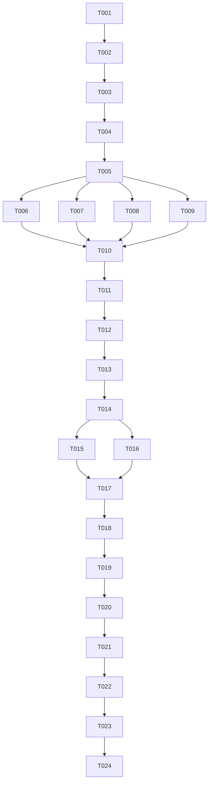

# Tasks: Proxmox DNS Sync

**Input**: Design documents from `specs/001-proxmox-dns-sync/`

**Prerequisites**: plan.md (required), spec.md (required for user stories), research.md, data-model.md, contracts/

**Tests**: A TDD approach is strictly enforced. Write tests before coding.

**Organization**: Tasks are grouped by user story to enable independent implementation and testing of each story.

## Format: `[ID] [P?] [Story] Description`

- **[P]**: Can run in parallel (different files, no dependencies)
- **[Story]**: Which user story this task belongs to (e.g., US1, US2, US3)
- Include exact file paths in descriptions

---

## Phase 1: Setup (Shared Infrastructure)

**Purpose**: Project initialization and basic structure

- [x] T001 Initialize Go module at project root (`go mod init proxmox-dns-sync`)
- [x] T002 Configure golangci-lint in project root `.golangci.yml`

---

## Phase 2: Foundational (Blocking Prerequisites)

**Purpose**: Core infrastructure that MUST be complete before ANY user story can be implemented

**⚠️ CRITICAL**: No user story work can begin until this phase is complete

- [x] T003 Implement configuration loader parsing environment variables in `internal/config/config.go`
- [x] T004 Implement structured JSON logging using Go `slog` in `internal/logger/logger.go`
- [x] T005 [P] Create basic ProxmoxResource and DNSMapping data models in `internal/sync/models.go`

**Checkpoint**: Foundation ready - user story implementation can now begin in parallel

---

## Phase 3: User Story 1 - Sync VM/LXC states to Pi-hole (Priority: P1) 🎯 MVP

**Goal**: Query Proxmox VE API for running VMs and LXC containers, extract IP addresses, resolve name collisions using VM ID suffixes, map the first VM (lowest ID) to an alias, and push A records to Pi-hole.

**Independent Test**: Start a virtual machine in Proxmox, execute the CLI, and confirm the A record appears in Pi-hole and resolves locally.

### Tests for User Story 1
> **NOTE: Write these tests FIRST, ensure they FAIL before implementation**

- [x] T006 [P] [US1] Write test for Proxmox API client fetching resources in `internal/proxmox/client_test.go`
- [x] T007 [P] [US1] Write test for Pi-hole API client A record insertion in `internal/pihole/client_test.go`
- [x] T008 [P] [US1] Write test for collision resolution and hostname mappings inside `internal/sync/sync_test.go`
- [x] T009 [P] [US1] Write test for local state registry saving logic inside `internal/sync/state_test.go`

### Implementation for User Story 1
- [x] T010 [US1] Implement Proxmox client fetching running VM/LXC IP addresses in `internal/proxmox/client.go`
- [x] T011 [US1] Implement Pi-hole client A record registration in `internal/pihole/client.go`
- [x] T012 [US1] Implement hostname sorting, suffixing, and mapping logic in `internal/sync/sync.go`
- [x] T013 [US1] Implement local state registry saving (`FQDN -> IP`) to `/var/lib/proxmox-dns-sync/state.json` in `internal/sync/state.go`
- [x] T014 [US1] Connect Proxmox client, Pi-hole client, and collision mapping in `cmd/proxmox-dns-sync/main.go`

**Checkpoint**: At this point, User Story 1 should be fully functional and testable independently.

---

## Phase 4: User Story 2 - Prune stale DNS records (Priority: P2)

**Goal**: Prune custom DNS records in Pi-hole that are no longer running on Proxmox, ensuring we ONLY delete records registered in `/var/lib/proxmox-dns-sync/state.json` and protect external entries.

**Independent Test**: Stop a VM, execute the CLI, and verify the record is deleted from Pi-hole. Confirm that manual A records in Pi-hole or Kubernetes ExternalDNS records are NOT modified/deleted.

### Tests for User Story 2
> **NOTE: Write these tests FIRST, ensure they FAIL before implementation**

- [x] T015 [P] [US2] Write test for Pi-hole client delete/prune requests in `internal/pihole/client_test.go`
- [x] T016 [P] [US2] Write test for diff-based pruning checking local state registry files in `internal/sync/sync_test.go`

### Implementation for User Story 2
- [x] T017 [US2] Implement Pi-hole client deletion method in `internal/pihole/client.go`
- [x] T018 [US2] Implement diff calculations restricting deletions to local state registry items in `internal/sync/sync.go`
- [x] T019 [US2] Integrate deletion run workflow in main entrypoint `cmd/proxmox-dns-sync/main.go`

**Checkpoint**: At this point, User Story 2 should be fully functional and testable independently.

---

## Phase 5: User Story 3 - Periodic automated sync (Priority: P3)

**Goal**: Run the synchronization automatically every 5 minutes in the background using systemd timer.

**Independent Test**: Wait 5 minutes after creating a VM and verify its hostname resolves.

### Implementation for User Story 3
- [ ] T020 [US3] Create systemd service unit definition in `deploy/systemd/sync-proxmox-dns.service`
- [ ] T021 [P] [US3] Create systemd timer unit definition in `deploy/systemd/sync-proxmox-dns.timer`
- [ ] T022 [P] [US3] Create installation script in `deploy/systemd/install.sh`

**Checkpoint**: At this point, User Story 3 is complete and the daemon runs periodically.

---

## Phase 6: Polish & Cross-cutting Concerns

- [ ] T023 Verify test coverage achieves >90% project-wide
- [ ] T024 Run golangci-lint check and resolve warnings project-wide

---

## Dependencies



---

## Parallel Example: User Story 1

```bash
# Run unit test tasks for US1 in parallel:
Task: T006 [P] [US1] Write test for Proxmox API client fetching resources in internal/proxmox/client_test.go
Task: T007 [P] [US1] Write test for Pi-hole API client A record insertion in internal/pihole/client_test.go
Task: T008 [P] [US1] Write test for collision resolution and hostname mappings inside internal/sync/sync_test.go
Task: T009 [P] [US1] Write test for local state registry saving logic inside internal/sync/state_test.go
```

---

## Implementation Strategy

### MVP First (User Story 1 Only)

1. Complete Phase 1: Setup
2. Complete Phase 2: Foundational (CRITICAL - blocks all stories)
3. Complete Phase 3: User Story 1
4. **STOP and VALIDATE**: Test User Story 1 independently
5. Deploy/demo if ready

### Incremental Delivery

1. Complete Setup + Foundational → Foundation ready
2. Add User Story 1 → Test independently → Deploy/Demo (MVP!)
3. Add User Story 2 → Test independently → Deploy/Demo
4. Add User Story 3 → Test independently → Deploy/Demo
5. Each story adds value without breaking previous stories

---

## Notes

- [P] tasks = different files, no dependencies
- [Story] label maps task to specific user story for traceability
- Each user story should be independently completable and testable
- Verify tests fail before implementing
- Commit after each task or logical group
- Stop at any checkpoint to validate story independently
- Avoid: vague tasks, same file conflicts, cross-story dependencies that break independence
